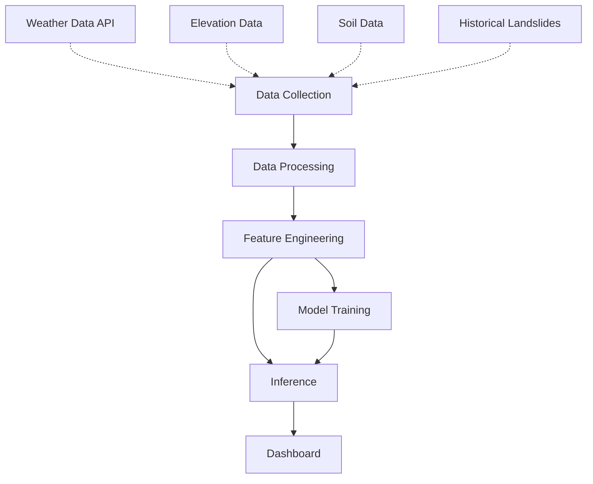

# Landslide Detection System for North Eastern India

A system for monitoring, detecting, and predicting landslides in the highly vulnerable North Eastern states of India.

## Architecture



## Data Sources
| Source | Type | Description |
|---|---|---|
| Open-Meteo | Weather | Historical and forecast rainfall, temperature |
| USGS | Earthquake | Seismic activity |
| Bhuvan WMS | Geography | Land cover, geological data |
| GSI/NESAC | Historical | Landslide catalogs |

## Installation
```bash
pip install -r requirements.txt
python setup.py install
```

## Quick Start
```bash
streamlit run app.py
```

## Project Structure
```
landslide_detection_ne_india/
├── config/
│   └── settings.py
├── data/
│   ├── raw/
│   ├── processed/
│   └── sample/
├── src/
│   ├── utils/
│   ├── data/
│   ├── models/
│   └── visualization/
├── app.py
├── requirements.txt
├── setup.py
└── README.md
```

## Features
- Real-time weather data integration
- Machine learning-based landslide prediction
- Interactive dashboard for visualization
- Customizable risk thresholds and monitoring locations

## Technology Stack
- Python 3.10+
- Pandas, NumPy, Scikit-learn, XGBoost
- Streamlit, Folium, Plotly

## License
MIT License

## Acknowledgments
- Open-Meteo
- USGS
- ISRO/Bhuvan
- Geological Survey of India (GSI)
- North Eastern Space Applications Centre (NESAC)
